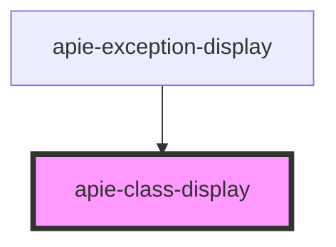

# apie-class-display

<!-- Auto Generated Below -->

## Properties

| Property       | Attribute        | Description | Type     | Default     |
| -------------- | ---------------- | ----------- | -------- | ----------- |
| `phpClassName` | `php-class-name` |             | `string` | `undefined` |

## Dependencies

### Used by

 - [apie-exception-display](../apie-exception-display)

### Graph

----------------------------------------------

*Built with [StencilJS](https://stenciljs.com/)*
