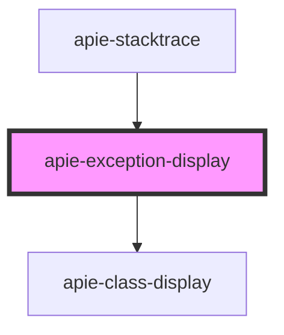

# apie-exception-display

<!-- Auto Generated Below -->

## Properties

| Property       | Attribute        | Description | Type                  | Default     |
| -------------- | ---------------- | ----------- | --------------------- | ----------- |
| `code`         | `code`           |             | `number`              | `undefined` |
| `message`      | `message`        |             | `string`              | `undefined` |
| `phpClassName` | `php-class-name` |             | `string`              | `undefined` |
| `phpVersion`   | `php-version`    |             | `string`              | `undefined` |
| `trace`        | --               |             | `WrappedErrorTrace[]` | `undefined` |

## Dependencies

### Used by

 - [apie-stacktrace](../apie-stacktrace)

### Depends on

- [apie-class-display](../apie-class-display)

### Graph

----------------------------------------------

*Built with [StencilJS](https://stenciljs.com/)*
