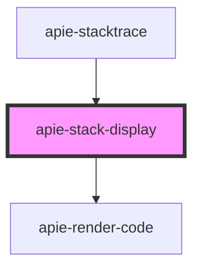

# apie-stack-display

<!-- Auto Generated Below -->

## Properties

| Property | Attribute | Description | Type                  | Default     |
| -------- | --------- | ----------- | --------------------- | ----------- |
| `trace`  | --        |             | `WrappedErrorTrace[]` | `undefined` |

## Dependencies

### Used by

 - [apie-stacktrace](../apie-stacktrace)

### Depends on

- [apie-render-code](../apie-render-code)

### Graph

----------------------------------------------

*Built with [StencilJS](https://stenciljs.com/)*
